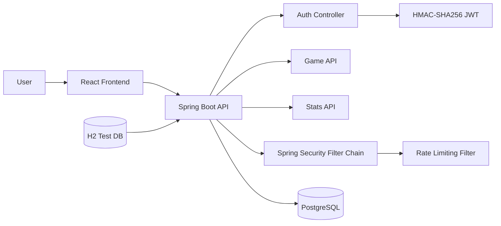

# Cosmic Wordle

> Docker/env 분리, JWT 인증, 보안 설정 정리를 통해 개발 환경과 backend 안정성을 다듬은 Wordle 웹 게임 프로젝트

## 프로젝트 개요

Cosmic Wordle은 Wordle 게임을 웹 서비스 형태로 구현한 프로젝트입니다. 게임 기능 자체와 함께 회원가입, 로그인, JWT 인증, 통계 API, Docker Compose 기반 실행 환경을 포함합니다.

포트폴리오에서는 주력 cloud project라기보다 backend 보안과 개발 환경 정리 경험을 보여주는 보조 프로젝트로 사용합니다. 특히 Docker와 env 분리를 통한 개발 환경 통일, 상황에 맞춘 로그인/보안 방식 변경을 담당 파트로 강조합니다.

## 문제 정의

웹 게임도 실제 서비스처럼 운영하려면 게임 API만으로는 충분하지 않습니다. 사용자를 식별하고, 통계를 저장하고, 인증 endpoint를 보호하고, 개발자가 같은 환경에서 실행할 수 있는 구조가 필요합니다.

초기 인증 방식과 환경 설정은 프로젝트 규모에 비해 복잡하거나 운영 부담이 생길 수 있었기 때문에, 단순하고 일관된 방식으로 정리할 필요가 있었습니다.

## 해결 방법

- Docker Compose로 frontend, backend, database 실행 환경을 맞췄습니다.
- env 파일과 Spring profile을 분리해 dev/test/prod 설정을 구분했습니다.
- 로그인/회원가입 API와 JWT 기반 인증 흐름을 구성했습니다.
- HMAC-SHA256 JWT 방식으로 인증 구조를 단순화했습니다.
- 인증 endpoint에는 IP 기반 Rate Limiting filter를 적용했습니다.
- CORS와 Security Filter Chain을 정리해 API 접근 정책을 명확히 했습니다.

## 주요 기능

- Wordle 게임 API
- 회원가입 및 로그인
- JWT 기반 인증/인가
- 사용자별 게임 통계 저장
- 인증 endpoint Rate Limiting
- dev/test/prod 환경 분리
- Docker Compose 기반 local setup
- GitHub Actions 기반 build/test 흐름

## 기술 스택

| 구분 | 기술 |
|---|---|
| Frontend | React, TypeScript |
| Backend | Kotlin, Spring Boot, Spring Security |
| Auth/Security | JWT, HMAC-SHA256, Rate Limiting, CORS |
| Database | PostgreSQL, H2 test |
| Infra | Docker, Docker Compose |
| CI | GitHub Actions |

## Architecture



## 내가 담당한 역할

- Docker Compose 기반 개발 환경 통일
- env 분리와 dev/test/prod profile 정리
- 로그인 및 인증 흐름 구현
- 프로젝트 상황에 맞춘 보안 방식 변경
- HMAC-SHA256 JWT 구조 적용
- Rate Limiting과 CORS/Security 설정 정리

## 문제 해결 과정

### 개발 환경 통일

로컬 환경 차이로 실행 결과가 달라지지 않도록 Docker Compose를 사용해 backend, frontend, database 실행 흐름을 정리했습니다. env 파일과 profile을 나누어 개발, 테스트, 운영 설정이 섞이지 않도록 했습니다.

### 인증 방식 단순화

프로젝트 규모에 비해 RSA 기반 Authorization Server 방식은 관리해야 할 요소가 많았습니다. HMAC-SHA256 JWT 방식으로 구조를 단순화해 secret 기반 인증 흐름을 유지하면서 구현 복잡도를 줄였습니다.

### Security Filter Chain 정리

인증이 필요한 API와 공개 endpoint를 분리하고, `/api/**`, `/stats/**`, `/login` 흐름을 각각 다루도록 Security 설정을 정리했습니다. 이를 통해 게임 API, 통계 API, 인증 API가 서로 다른 접근 정책을 갖도록 구성했습니다.

### Rate Limiting 적용

로그인과 회원가입 endpoint는 반복 요청에 노출되기 쉽습니다. `RateLimitingFilter`를 통해 인증 endpoint에 IP 기반 요청 제한을 적용하고, Spring Security 처리 전에 요청을 차단할 수 있도록 구성했습니다.

## 코드 구조에서 확인할 수 있는 근거

- `backend/src/main/kotlin/.../auth/`: 회원가입, 로그인, 사용자 도메인
- `backend/src/main/kotlin/.../security/JwtConfig.kt`: HMAC JWT encoder/decoder
- `backend/src/main/kotlin/.../security/JwtSecurityConfig.kt`: Security Filter Chain
- `backend/src/main/kotlin/.../security/filter/RateLimitingFilter.kt`: 요청 제한 filter
- `backend/src/main/resources/application-{dev,test,prod}.yml`: 환경별 설정
- `docker-compose.yml`: local service orchestration

## 실행 방법

```bash
git clone https://github.com/protove/wordle.git
cd wordle
docker compose up --build
```

환경별 실행에는 database, JWT secret, profile 관련 환경 변수가 필요합니다.

## 관련 링크

- GitHub: https://github.com/protove/wordle
